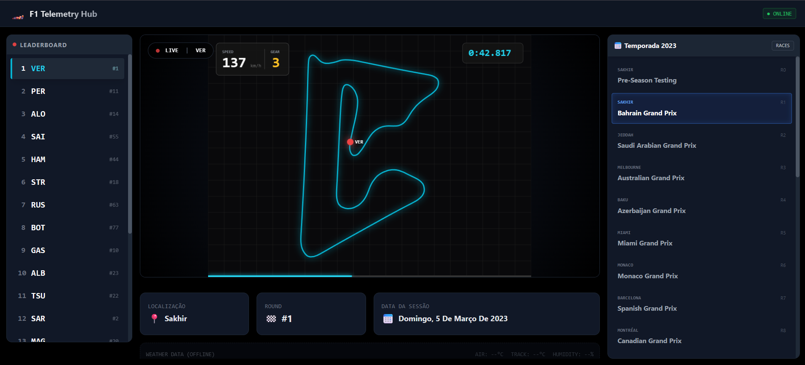

# 🏎️ F1 Telemetry Hub

> **Dashboard de Telemetria da Fórmula 1 em Tempo Real (Fullstack)**



## 📖 Sobre o Projeto

O **F1 Telemetry Hub** é uma aplicação web interativa que permite visualizar e analisar dados de telemetria de corridas reais da Fórmula 1. O sistema simula o replay de voltas rápidas, desenhando o traçado da pista dinamicamente e exibindo dados como velocidade, marcha, frenagem e aceleração em um painel estilo transmissão de TV.

### 🧬 Evolução
Este projeto é uma **evolução Fullstack (Web)** do meu projeto anterior de análise de dados Desktop/Script.
Você pode conferir a versão original aqui: [F1-Telemetry-Viz](https://github.com/smartielo/F1-Telemetry-Viz).

Enquanto o antecessor focava na extração e plotagem estática com Matplotlib, esta versão traz:
- **Interatividade:** Navegação dinâmica entre corridas e pilotos.
- **Animação:** Renderização a 60 FPS usando HTML5 Canvas.
- **Arquitetura Moderna:** Separação completa entre Backend (API) e Frontend (SPA).

---

## 🚀 Tecnologias Utilizadas

### Backend (API)
- **Python 3.11+**
- **FastAPI:** Para criação da API REST de alta performance.
- **FastF1:** Biblioteca oficial para extração de dados da F1 (Live Timing & Telemetry).
- **Pandas:** Manipulação e tratamento de Dataframes.

### Frontend (Interface)
- **React.js (Vite):** Framework reativo moderno.
- **Tailwind CSS:** Estilização profissional e responsiva (Layout Grid/Flex).
- **HTML5 Canvas API:** Para desenhar e animar a pista com alta performance.
- **Axios:** Comunicação com o Backend.

---

## ⚡ Funcionalidades

- ✅ **Mapeamento de Pista:** Desenho automático do traçado baseado em coordenadas GPS reais.
- ✅ **Replay em Tempo Real:** Simulação da volta do piloto com dados sincronizados.
- ✅ **HUD de Telemetria:** Velocômetro, Indicador de Marchas e Cronômetro.
- ✅ **Seletor de Temporada:** Calendário dinâmico (atualmente focado em 2023).
- ✅ **Leaderboard:** Lista de pilotos da sessão selecionada.
- ✅ **Painel Técnico:** Informações sobre o circuito, round e data da sessão.

---

## 🛠️ Como Rodar Localmente

Siga os passos abaixo para ter o projeto rodando na sua máquina.

### Pré-requisitos
- Python 3.10+
- Node.js & NPM

### 1. Configurando o Backend (Python)
```bash
# Entre na pasta do backend
cd backend

# Instale as dependências
pip install -r requirements.txt

# Inicie o servidor
python -m uvicorn main:app --reload
```
O servidor rodará em: http://127.0.0.1:8000

---

### 2. Configurando o Frontend (React)
```bash
# Em outro terminal, entre na pasta frontend
cd frontend

# Instale as dependências
npm install

# Crie um arquivo .env.local na raiz do frontend com o conteúdo:
echo "VITE_API_URL=[http://127.0.0.1:8000](http://127.0.0.1:8000)" > .env.local

# Inicie o projeto
npm run dev
```
Acesse o projeto em: http://localhost:5173

---

## ☁️ Deploy (Produção)
O projeto está configurado para deploy híbrido:

* Backend: Hospedado no Render.com (Web Service Python).
* Frontend: Hospedado na Vercel.

---

## 🔮 Futuro do Projeto (Roadmap)

[ ] Implementação de Visualização 3D da pista (Three.js).

[ ] Integração com dados de Clima (Temperatura da Pista/Ar).

[ ] Comparação de Telemetria (Ghost Car) entre dois pilotos.

---

### Made with 💜 and Python by Gabriel Martielo.